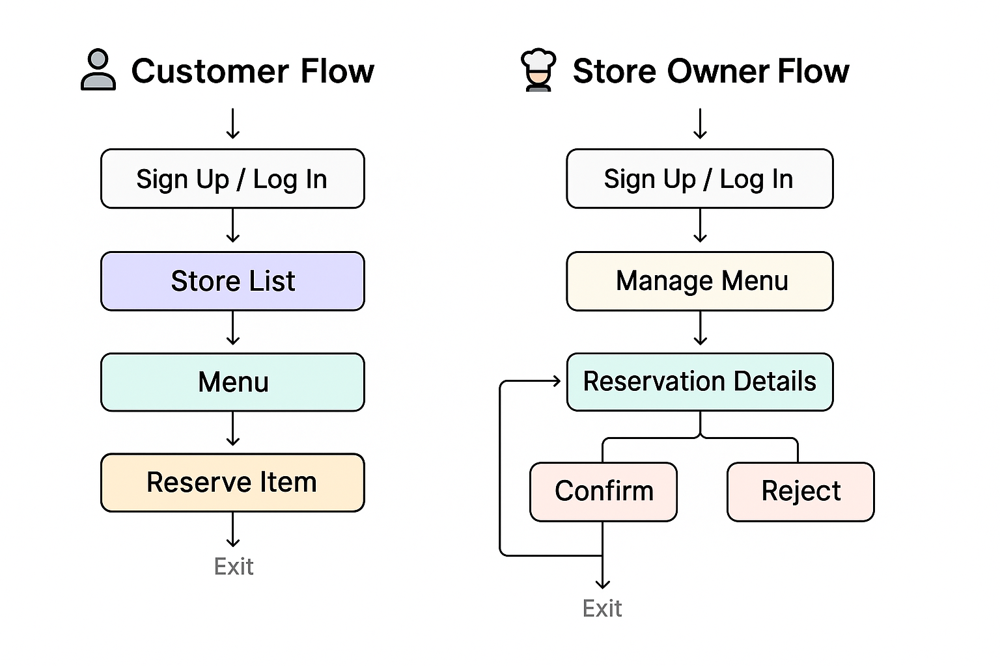

# Share Plate 🍱

**A mobile app for easily purchasing last-minute discounted meals**

This app helps users check real-time last-minute discounts from nearby restaurants and make reservations at affordable prices.
From the restaurant's perspective, it reduces food waste, and for users, it offers delicious food at low prices. It is a **socially responsible consumption platform**.

<br />

## 🛠️ Tech Stack

* **React Native (Expo)**
* **TypeScript**
* **Firebase Authentication**
* **Firebase Firestore**
* **AsyncStorage**
* **React Navigation**

<br />

## 📱 Key Features

### 👤 Customer (User)

| Feature                 | Description                                                  |
| ----------------------- | ------------------------------------------------------------ |
| 🔐 Sign Up / Login      | Email-based login using Firebase Authentication              |
| 🏪 View Store List      | View a list of discounted restaurants/menus                  |
| 🍱 Menu Details         | Check images, descriptions, quantity, prices, etc.           |
| 📦 Make Reservations    | Reserve items with remaining quantity                        |
| 🛍️ Check Reservations  | Check status of reserved items (confirmed / rejected / done) |
| ❤️ Favorites (Upcoming) | Save frequently visited stores as favorites                  |

<br />

### 🧑‍🍳 Restaurant Owner

| Feature                         | Description                              |
| ------------------------------- | ---------------------------------------- |
| 🍽️ Menu Management             | Add, edit, delete menus                  |
| 📅 Reservation Management       | Confirm / reject / complete pickups      |
| 🧾 Review Management (Upcoming) | Check and reply to user reviews          |
| 💰 Settlement (Upcoming)        | View daily/monthly sales and settlements |

> 🔜 *Review and settlement features will be added in future updates.*

<br />

## 🗄️ App Preview

> Check out the real usage flows of users and owners through GIFs!

---

### 👤 User Flow

* Store List → Menu Details → Reservation → Reservation History

🎞️ **Demo Video (User)** 

---

### 🧑‍🍳 Owner Flow

* View Reservations → Accept/Reject → Complete Pickup
* Register/Edit Menus

🎞️ **Demo Video (Owner)** 

<br />

## 🗌 User Flow Diagram

> Visual overview of how both customers and owners use the app.



<br />

## 📂 Directory Structure

```bash
src/
├── components/        # Shared UI components
├── context/           # Global states like auth
├── navigation/        # React Navigation configurations
├── screens/           # Home, Store, Reservation, etc.
├── services/          # Firebase API integrations
├── styles/            # Shared styles
├── types/             # Type definitions
└── utils/             # Utility functions
```

<br />

## ✨ Highlights & Challenges Solved

* Resolved placeholder & secure input issues across devices
* Automated app deployment & testing via Expo Go on Android
* Designed and handled CRUD operations for latest Firebase Auth & Firestore structure
* Ensured cross-platform compatibility for both iOS/Android
* Disabled reservation button when item stock reaches zero

<br />

## 🧪 Future Plans

* 📍 Location-based restaurant recommendations
* 🛒 Payment integration (e.g., KakaoPay)
* 📤 Push notifications for reservation confirmations
* 📈 Sales analytics dashboard (for owners)

<br />

## ✨ Additional Info

### 🌐 Deployment Link

> Try the app yourself!
> (📱 *Expo Go app required — [Download Here](https://expo.dev/client)*)

* 📷 Scan the QR code below to open instantly:


> ※ Available on both iOS and Android. Just install Expo Go to test the app!

<br />

🇰🇷 [View in Korean](./README.md)
