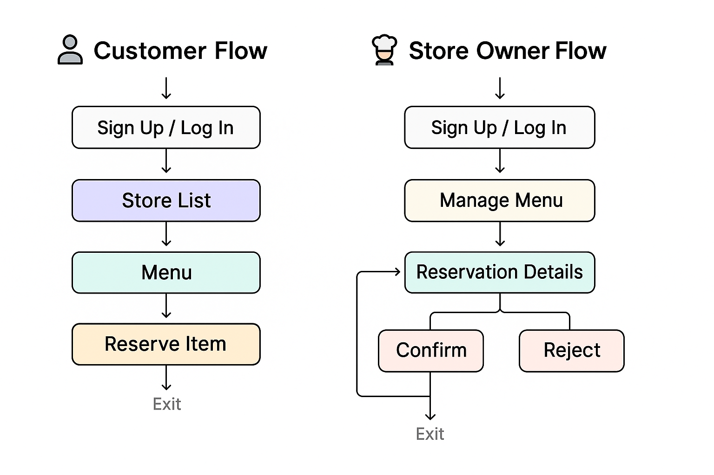

# Share Plate 🍱

**마감 할인 음식을 손쉽게 구매할 수 있는 모바일 앱**

이 앱은 사용자가 가까운 식당의 마감 할인 음식을 실시간으로 확인하고, 합리적인 가격에 예약 구매할 수 있도록 도와줍니다.  
식당 입장에서는 남는 재고를 줄이고, 사용자에게는 맛있는 음식을 저렴하게 제공하는 **착한 소비 플랫폼**입니다.

<br />

## 🛠️ 기술 스택

-   **React Native (Expo)**
-   **TypeScript**
-   **Firebase Authentication**
-   **Firebase Firestore**
-   **AsyncStorage**
-   **React Navigation**

<br />

## 📱 주요 기능

### 👤 고객 (일반 사용자)

| 기능                 | 설명                                                 |
| -------------------- | ---------------------------------------------------- |
| 🔐 회원가입 / 로그인 | Firebase 인증을 통한 이메일 기반 로그인              |
| 🏪 가게 목록 보기    | 할인 중인 식당/메뉴 리스트 확인                      |
| 🍱 음식 상세 페이지  | 이미지, 설명, 수량, 가격 등 확인                     |
| 📦 예약 기능         | 수량이 남아있는 메뉴에 대해 예약 가능                |
| 🛍️ 예약 내역 확인    | 내가 예약한 음식의 상태 확인 (확정 / 반려 / 완료 등) |
| ❤️ 즐겨찾기 (예정)   | 자주 가는 가게 즐겨찾기로 저장                       |

<br />

### 🧑‍🍳 가게 사장 (사업자)

| 기능                | 설명                                                |
| ------------------- | --------------------------------------------------- |
| 🍽️ 메뉴 관리        | 메뉴 추가, 수정, 삭제                               |
| 📅 예약 관리        | 들어온 예약을 **확정 / 반려 / 픽업 완료 처리** 가능 |
| 🧾 리뷰 관리 (예정) | 고객이 남긴 리뷰 확인 및 응답                       |
| 💰 정산 관리 (예정) | 월별/일별 판매 내역 정산 기능                       |

> 🔜 _리뷰 및 정산 기능은 추후 버전에 추가될 예정입니다._

<br />

## 🖼️ 앱 미리보기

> 고객과 사장님의 실제 사용 흐름을 각각 GIF로 확인해보세요!

---

### 👤 고객(User) 흐름

-   가게 리스트 → 메뉴 상세 → 예약 → 예약 목록 확인

🎞️ **시연 영상 (고객)**  


---

### 🧑‍🍳 가게 사장(Owner) 흐름

-   예약 목록 확인 → 예약 수락/거절 → 픽업 완료 처리
-   메뉴 등록/수정

🎞️ **시연 영상 (사장)**  


<br />

## 🗺️ 사용 흐름 다이어그램

> 고객과 사장님의 앱 사용 흐름을 한눈에 볼 수 있어요.



<br />

## 📂 디렉토리 구조

```bash
src/
├── components/        # 공통 UI 컴포넌트
├── context/           # 사용자 인증 등 전역 상태 관리
├── navigation/        # 앱 내 화면 이동 관련 설정 (React Navigation 사용)
├── screens/           # Home, Store, Reservation 등 주요 화면
├── services/          # Firebase 관련 API
├── styles/            # 공통 스타일
├── types/             # 타입 정의
└── utils/             # 공용 유틸 함수
```

<br />

## ✨ 특징 및 개발 중 해결한 문제들

-   기기별 placeholder, secure 입력 문제 해결
-   Android에서 Expo Go 앱 배포 및 테스트 자동화
-   Firebase 최신 Auth, Firestore 구조 설계 및 CRUD 처리
-   iOS/Android 양쪽 모두에서 정상 작동하도록 호환성 고려
-   가게의 재고 수량이 0일 경우 예약 버튼 비활성화 처리

<br />

## 🧪 향후 개발 계획

📍 위치 기반 가게 추천 기능

🛒 결제 시스템 연동 (카카오페이 등)

📤 예약 완료 푸시 알림

📈 판매 통계 대시보드 (가게 관리자용)

<br />

## ✨ 부가 정보

### 🌐 배포 링크

> 직접 앱을 체험해보세요!  
> (📱 _Expo Go 앱 필요 — [설치하러 가기](https://expo.dev/client)_)

-   📷 아래 QR 코드를 스캔하면 바로 실행됩니다!


> ※ iOS/Android 모두 지원됩니다. Expo Go 앱만 설치되어 있으면 테스트 가능해요!

<br />

🇺🇸 [View in English](./README.eng.md)
